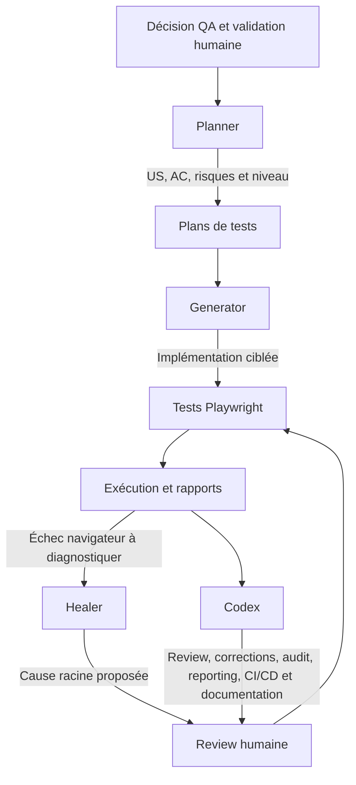
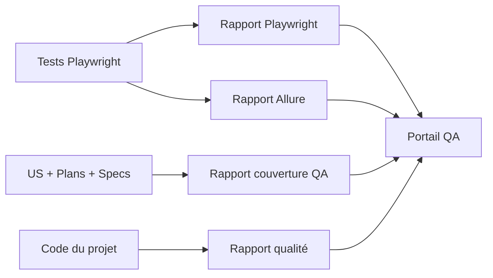
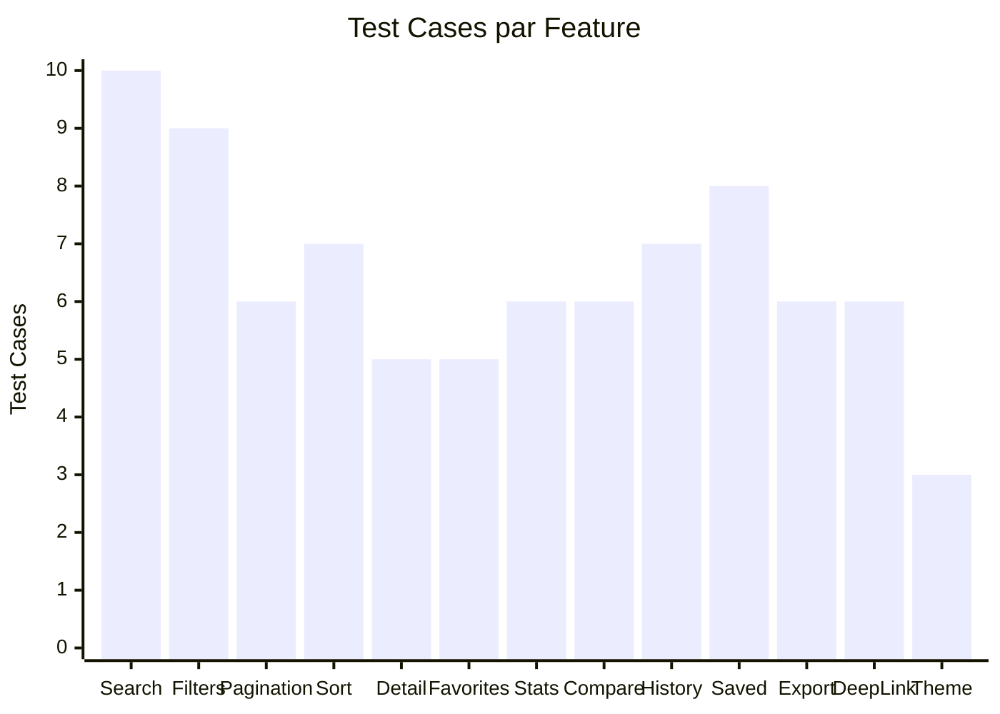
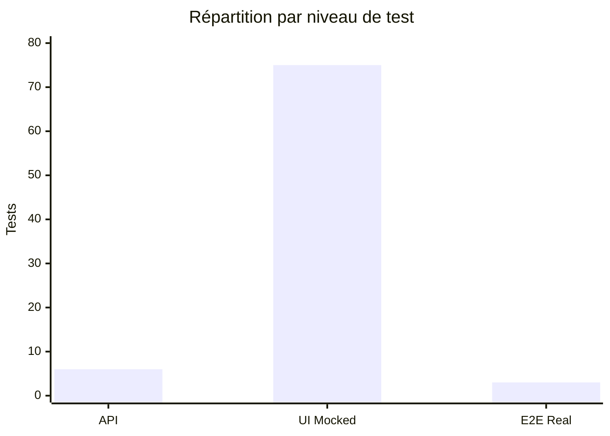
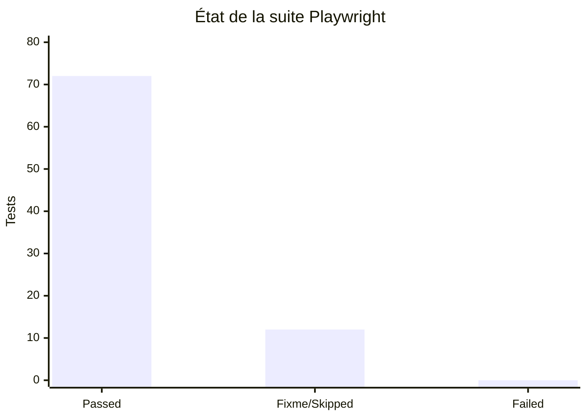
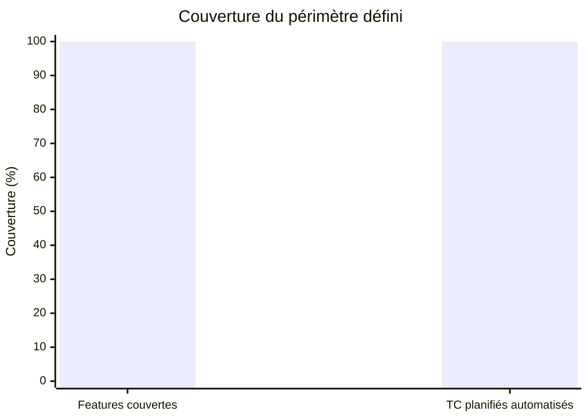
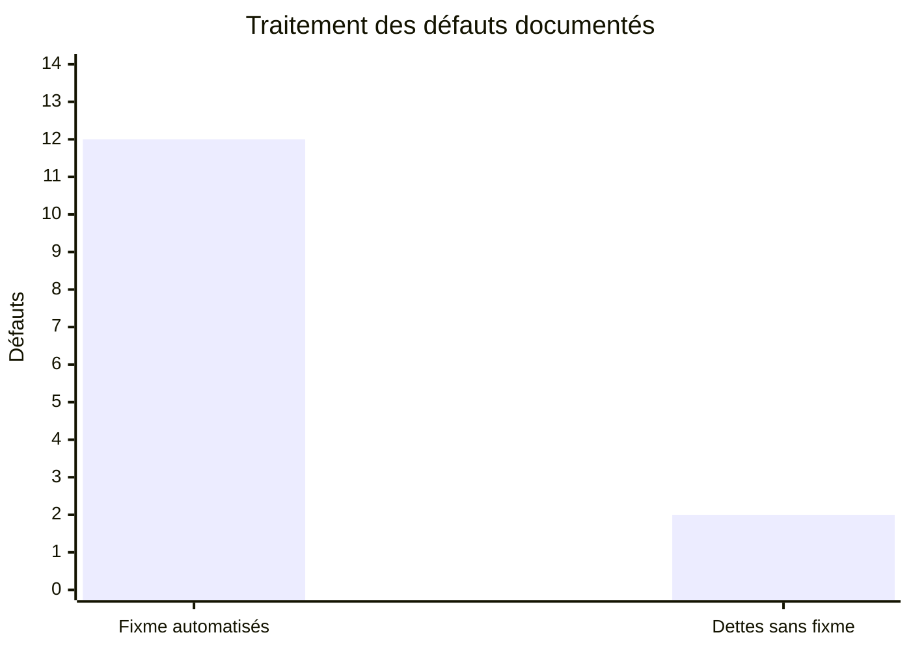

# Sprint Review — French Companies Explorer Playwright Agents

## 1. Présentation du projet

**French Companies Explorer Playwright Agents** est le repository d'automatisation QA de l'application publique [French Companies Explorer](https://maximejoannis.github.io/french-companies-explorer-qa/).

L'application est un frontend statique HTML, CSS et JavaScript connecté directement à l'API gouvernementale publique et read-only `recherche-entreprises.api.gouv.fr`. Le projet automatise avec **Playwright Test et TypeScript** les responsabilités du frontend, les hypothèses observables du contrat API et quelques frontières d'intégration critiques.

La démarche couvre la conception par le risque, la traçabilité des exigences, l'exécution multi-niveaux, les quality gates, le reporting et la publication continue des preuves QA. Elle expérimente aussi les **Playwright Test Agents** et **Codex** dans un workflow cadré et revu.

> La couverture présentée correspond au périmètre fonctionnel défini pour cet exercice. Elle ne représente ni une couverture exhaustive de l'application, ni une couverture du code source, ni une validation exhaustive des règles métier de l'API gouvernementale.

---

# 2. Objectifs et portée

## Objectifs

Les objectifs du projet étaient de :

- construire une architecture Playwright maintenable en TypeScript ;
- tester un frontend dépendant d'une API publique externe ;
- définir une stratégie multi-niveaux adaptée à chaque responsabilité ;
- automatiser les User Stories et Test Cases du périmètre ;
- privilégier le niveau de test le plus bas apportant la confiance utile ;
- conserver quelques intégrations réelles entre le navigateur et l'API ;
- rendre les contrôles frontend déterministes avec des mocks ciblés ;
- intégrer dans Allure une traçabilité métier exploitable ;
- produire des rapports Playwright, Allure, couverture QA et qualité ;
- industrialiser les quality gates ;
- intégrer l'exécution et les rapports à une chaîne CI/CD ;
- publier un portail QA avec GitHub Pages ;
- expérimenter les Playwright Test Agents et Codex dans un workflow QA contrôlé.

## Portée fonctionnelle

Le repository formalise 13 Features, chacune rattachée à une User Story et à un plan de test. Le tableau compte les tests automatisés portant un identifiant `TC-*` ; il inclut `TC-SAVED-008`, ajouté pour tracer `BUG-011` après la rédaction initiale du plan Saved Searches.

| Feature        | Nombre de Test Cases |
| -------------- | -------------------: |
| Search         |                   10 |
| Filters        |                    9 |
| Pagination     |                    6 |
| Sort           |                    7 |
| Detail         |                    5 |
| Favorites      |                    5 |
| Stats          |                    6 |
| Compare        |                    6 |
| History        |                    7 |
| Saved Searches |                    8 |
| Export         |                    6 |
| Deep Linking   |                    6 |
| Theme          |                    3 |
| **Total**      |               **84** |

Le périmètre associe cas nominaux, erreurs, états rares, persistance, intégration réelle et tests de non-régression de défauts connus. Il ne cherche pas à maximiser le nombre de tests.

---

# 3. Résultats du périmètre automatisé

La baseline finale enregistrée dans les rapports du repository est verte.

| Indicateur                                 |            Résultat |
| ------------------------------------------ | ------------------: |
| Features couvertes                         | **13 / 13 (100 %)** |
| Test Cases présents dans les plans         |              **83** |
| Test Cases automatisés                     |              **84** |
| Tests Playwright                           |              **84** |
| Tests actifs                               |              **72** |
| Tests `fixme` connus                       |              **12** |
| Échecs inattendus                          |               **0** |
| Tests API réels                            |               **6** |
| Tests UI mockés                            |              **75** |
| Tests E2E réels                            |               **3** |
| Couverture du périmètre fonctionnel défini |           **100 %** |

Le rapport de couverture ne détecte aucun TC planifié sans automatisation. L'écart `83 planifiés / 84 automatisés` correspond uniquement à `TC-SAVED-008`, automatisation hors version initiale du plan et liée à un défaut documenté ; il ne masque aucun manque.

Dans ce document, **100 % signifie que 100 % des Test Cases définis dans le périmètre fonctionnel retenu disposent d'une automatisation** et que les 13 Features ont une preuve automatisée. Il ne s'agit pas de code coverage, d'une validation exhaustive de l'application ou de l'API, ni d'une garantie d'absence de bugs. Les 12 `fixme` sont des oracles conservés face à des défauts produit connus ; ils sont distincts des échecs inattendus.

---

# 4. Méthodologie

```mermaid
flowchart LR
    A[Exploration de l'application] --> B[User Stories]
    B --> C[Plans de tests]
    C --> D[Choix du niveau de test]
    D --> E[API / UI mockée / E2E réel]
    E --> F[Implémentation]
    F --> G[Review et audit]
    G --> H[Quality Gates]
    H --> I[Reporting]
    I --> J[CI/CD]
    J --> K[Portail QA]
```



## 4.1 Exploration et définition du périmètre

Le frontend a été observé avant la formalisation des comportements. Cette exploration a séparé deux sources de vérité :

- le **comportement du frontend**, produit testable dont les attentes fonctionnelles peuvent être décrites ;
- l'**API gouvernementale**, dépendance externe dont le contrat observable peut être vérifié, mais dont les règles métier ne doivent pas être inventées.

Cette distinction évite de transformer une donnée publique momentanée en règle métier du projet.

## 4.2 User Stories et plans de tests

La traçabilité suit une chaîne explicite :

```text
Besoin métier → User Story → Critère d'acceptation → Test Case → test automatisé
                   US-*              AC-*              TC-*
```

Les 13 User Stories décrivent la valeur attendue, leurs critères d'acceptation définissent des comportements observables et les plans choisissent des cas fondés sur les risques. Les IDs `TC-*` sont repris dans les titres Playwright et les métadonnées Allure relient **Epic → Feature → Story → Test Case**.

## 4.3 Choix du niveau de test

> Le niveau le plus bas qui apporte la confiance utile est privilégié, afin d'éviter la duplication et le coût inutile des E2E.

### API réel — 6 tests

Les tests sous `tests/api/` utilisent Playwright `APIRequestContext` et uniquement des requêtes `GET` vers l'API gouvernementale réelle. Ils vérifient le statut HTTP, la structure minimale, la pagination et la prise en compte de paramètres de recherche ou de filtre.

Les données étant publiques et volatiles, les assertions portent sur des structures, cohérences et invariants observables. Elles évitent les volumes fixes, l'ordre non contractualisé et toute règle métier gouvernementale supposée.

### UI mockée — 75 tests

Le niveau principal isole la logique du frontend avec `page.route()` et de petites réponses déterministes. Il couvre notamment :

- le rendu, les états vide, erreur et chargement ;
- les filtres, la pagination, le tri et les statistiques ;
- les favoris, la comparaison, l'historique et les recherches sauvegardées ;
- les exports JSON et CSV, dont la neutralisation des formules ;
- le deep linking et la persistance du thème ;
- les états `localStorage`, les reloads et les cas limites difficiles à reproduire avec des données publiques.

> Ne jamais mocker ce que l'on cherche précisément à valider.

Les mocks prouvent donc la responsabilité du frontend, pas le contrat réel de l'API.

### E2E réel — 3 tests

Trois frontières critiques associent le navigateur à la vraie API : recherche textuelle et affichage, filtre Commune, puis ouverture du détail depuis un résultat réel. Elles vérifient que les deux systèmes communiquent réellement sans répliquer toute la couverture API dans le navigateur.

## 4.4 Architecture réelle

```text
.
├── .codex/agents/                 # Configurations Planner, Generator et Healer
├── .github/workflows/playwright.yml
├── defects/                       # BUG-001 à BUG-014
├── reporting/
│   ├── coverage/                  # Gabarit du rapport de couverture
│   ├── qa-portal/                 # Portail HTML/CSS/JavaScript
│   └── scripts/                   # Générateurs couverture et qualité
├── specs/                         # 13 US et 13 plans de tests
├── tests/
│   ├── api/search/                # APIRequestContext, API réelle
│   ├── mocks/                     # Jeux de données déterministes partagés
│   └── ui/
│       ├── pages/search.page.ts   # Page Object principal
│       └── specs/                 # UI mockée et E2E réel par domaine
├── AGENTS.md
├── AUDIT-FINAL.md
├── package.json
└── playwright.config.ts
```

L'application est une SPA centrée sur la recherche : un Page Object unique représente ce concept UI transversal sans masquer les assertions métier. Les mocks ne sont mutualisés que lorsqu'ils sont réellement réutilisés. Les dossiers `tests/fixtures`, `tests/helpers` et `tests/data` prévus par la convention peuvent rester absents ou vides : créer des abstractions uniquement pour remplir une arborescence réduirait la lisibilité sans bénéfice.

---

# 5. Utilisation des agents IA



### Planner

Le Planner analyse les User Stories, critères et risques, propose les scénarios nécessaires et aide à choisir entre `API`, `UI_MOCKED` et `E2E_REAL`. Son rôle n'est pas de transformer chaque interaction découverte en test navigateur.

### Generator

Le Generator aide à produire les tests navigateur lorsque ce niveau est pertinent, en conservant les IDs de traçabilité, les locators accessibles et la stratégie définie dans le plan.

### Healer

Le Healer peut diagnostiquer et proposer une correction pour un test navigateur défaillant. Il n'est pas une source automatique de vérité : avant toute modification, l'intention du TC et son critère d'acceptation restent l'oracle.

### Codex

Codex a assisté l'analyse du repository, l'implémentation, les reviews, les corrections d'audit, le reporting, la CI/CD et la documentation. Les prompts sont cadrés par `AGENTS.md` et les configurations versionnées sous `.codex/agents/`.

La validation reste humaine. Les agents accélèrent l'analyse et la production, mais les décisions de couverture, les règles attendues et les oracles ne leur sont jamais délégués aveuglément.

---

# 6. Outils et technologies

| Technologie / pratique       | Version ou utilisation réelle                                 |
| ---------------------------- | ------------------------------------------------------------- |
| **Playwright Test**          | `^1.62.1`, tests UI et API                                    |
| **TypeScript**               | `^6.0.3`, typage strict du projet                             |
| **Node.js / npm**            | Node.js 24 en CI, dépendances via `npm ci`                    |
| **Codex**                    | Assistance IA au workflow QA                                  |
| **Playwright Test Agents**   | Planner, Generator et Healer configurés dans `.codex/agents/` |
| **APIRequestContext**        | Appels `GET` vers l'API gouvernementale réelle                |
| **Page Object Model**        | Actions et locators de la page de recherche                   |
| **Mocks réseau Playwright**  | `page.route()` et payloads déterministes ciblés               |
| **Allure**                   | `allure-playwright ^3.11.0`, `allure-commandline ^2.43.0`     |
| **Playwright HTML Reporter** | Rapport d'exécution natif, traces et diagnostics              |
| **ESLint**                   | `^10.9.1` avec `eslint-plugin-playwright ^2.11.0`             |
| **Prettier**                 | `^3.9.6`                                                      |
| **Git / GitHub**             | Versionnement et hébergement                                  |
| **GitHub Actions**           | Validation, rapports, artefacts, quality gate et déploiement  |
| **GitHub Pages**             | Publication du portail QA consolidé                           |
| **HTML / CSS / JavaScript**  | Portail QA et vues de couverture / qualité                    |

Playwright MCP n'est pas revendiqué : le projet final ne le déclare ni comme dépendance ni comme composant de son pipeline.

---

# 7. Stratégie de reporting



- **Playwright HTML** donne le statut runtime, les traces et les diagnostics d'échec.
- **Allure** enrichit l'exécution par la hiérarchie Epic, Feature, Story et TC.
- **Couverture QA** calcule dynamiquement Features, TC, niveaux, tags et défauts depuis les sources.
- **Qualité** exécute Prettier, ESLint et TypeScript et publie leur résultat.
- **Portail consolidé** rassemble ces preuves avec le statut du build.

Le point d'entrée public est le [portail QA French Companies Explorer](https://maximejoannis.github.io/french-companies-explorer-playwright-agents/).

---

# 8. CI/CD

Le workflow réel `.github/workflows/playwright.yml` est déclenché sur un push vers `main`, une pull request vers `main` ou manuellement avec `workflow_dispatch`.

```mermaid
flowchart LR
    A[Push main / PR / workflow_dispatch] --> B[Checkout]
    B --> C[Node.js 24 + Java 17]
    C --> D[npm ci]
    D --> E[Rapport qualité]
    E --> F[Rapport couverture]
    F --> G[Installation Chromium]
    G --> H[Tests Playwright]
    H --> I[Rapport Allure]
    I --> J[Validation des rapports]
    J --> K[Artifact qa-reports]
    K --> L{Pull request ?}
    L -->|Oui| M[Quality gate final]
    L -->|Non| N[Construction du site]
    N --> O[Déploiement GitHub Pages]
    O --> M
```



Le job `validate` :

1. installe Node.js 24, Java 17 et les dépendances avec `npm ci` ;
2. génère les rapports qualité et couverture ;
3. installe Chromium avec ses dépendances ;
4. lance `npm test` sur le projet Chromium ;
5. génère Allure ;
6. vérifie la présence des sorties et la syntaxe des scripts JavaScript ;
7. publie pendant 30 jours l'artefact consolidé `qa-reports`.

Sur une pull request, le workflow valide la suite et les artefacts sans publier Pages. Sur `main` ou lors d'un déclenchement manuel hors PR, il construit le portail, configure GitHub Pages puis le déploie. Le job `quality-gate`, exécuté même en cas d'erreur antérieure, exige le succès de la qualité, de la couverture, des tests, d'Allure et, hors PR, du déploiement.

---

# 9. Défis rencontrés

## 9.1 Tester une application dépendante d'une API publique

### Défi

L'application dépend d'un service externe, d'une disponibilité réseau et de données qui évoluent. Le projet ne maîtrise pas les règles métier ni le cycle de vie de ces données.

### Solution

La couverture sépare tests API réels, UI mockée et E2E réels. Les tests de contrat vérifient des propriétés observables et utilisent des assertions tolérantes ; les scénarios frontend reposent sur des payloads minimaux déterministes.

### Enseignement

Une donnée externe ne doit pas devenir un oracle métier fragile. Le test doit distinguer contrat observable, contenu volatil et règle appartenant réellement au produit.

## 9.2 Trouver le bon équilibre entre mocks et tests réels

### Défi

Une suite entièrement mockée peut donner un faux sentiment de confiance. Une suite dominée par les E2E réels serait plus lente, coûteuse et sensible au réseau ou aux données publiques.

### Solution

La logique frontend est vérifiée en UI mockée, le contrat en API réel et trois jonctions critiques en E2E réel. Chaque niveau répond à une question distincte.

### Enseignement

Le bon niveau de test est un choix d'architecture. Les mocks ciblés et les E2E sélectifs apportent davantage de signal que la duplication systématique.

## 9.3 Gérer les défauts produit sans rendre la suite rouge

### Défi

L'automatisation a révélé des comportements clairement contraires aux critères d'acceptation. Accepter ces comportements dans les assertions aurait rendu la suite verte au prix d'un oracle incorrect.

### Solution

Les écarts sont documentés sous `BUG-001` à `BUG-014`. Douze tests conservent le résultat attendu avec `test.fixme` lorsque le produit empêche actuellement leur réussite. Les deux dettes d'accessibilité `BUG-006` et `BUG-012` restent documentées sans désactiver les parcours fonctionnels valides.

### Enseignement

Un test vert ne doit jamais être obtenu en affaiblissant artificiellement l'oracle. Un `fixme` explicite est une dette visible, pas un échec inattendu ni une nouvelle vérité produit.

## 9.4 Éviter les assertions métier inventées sur l'API

### Défi

L'audit final a détecté qu'un smoke E2E interprétait tout statut autre que `A`, y compris une valeur absente, comme « Cessée ». Cette assertion transformait une absence d'information en conclusion métier.

### Solution

La correction d'audit limite désormais l'oracle aux valeurs sources explicitement reconnues (`A` et `C`) et reste neutre sinon. Les tests API conservent la même discipline structurelle.

### Enseignement

Une dépendance externe ne doit pas recevoir une règle interne inventée par le test. L'absence de connaissance doit rester une absence de connaissance.

## 9.5 Synchroniser correctement l'UI avec le réseau

### Défi

Recherche, pagination, navigation et chargement sont asynchrones. Un listener installé après l'action peut manquer la réponse ; un délai fixe rendrait la suite lente et instable.

### Solution

Les tests combinent assertions auto-attendues et `page.waitForResponse()` préparé avant l'action. Le repository n'utilise ni `page.waitForTimeout()` arbitraire ni `networkidle` comme stratégie générique.

### Enseignement

Attendre un événement précis ou un état observable est plus robuste qu'attendre une durée supposée suffisante.

## 9.6 Tester les états persistants

### Défi

Favoris, comparaison, historique, recherches sauvegardées et thème utilisent des clés `localStorage` distinctes. Il fallait prouver ajout, retrait, limite, reload et isolation sans créer de dépendance entre tests.

### Solution

Chaque scénario maîtrise son contexte et son état initial, inspecte la clé concernée, utilise de vrais reloads lorsque la persistance est l'objet du test et vérifie la non-régression des stockages voisins lorsque pertinent.

### Enseignement

Tester la persistance demande de vérifier à la fois la continuité de l'état voulu et l'absence d'effets de bord sur les autres domaines.

## 9.7 Construire une couverture QA honnête

### Défi

Le code source de l'application et du backend n'appartient pas à ce repository. Les tests sont répartis sur trois niveaux et certains oracles sont volontairement en `fixme`.

### Solution

Le générateur calcule depuis les US, plans, specs et défauts les Features, TC planifiés, automatisés, actifs, `fixme`, niveaux et écarts. Les métriques statiques sont distinguées des résultats runtime et du code coverage.

### Enseignement

Une métrique n'est utile que si sa définition et ses exceptions sont visibles. Ici, 100 % décrit le périmètre fonctionnel retenu, pas l'ensemble du produit.

## 9.8 Industrialiser les preuves QA

### Défi

Des rapports Playwright, Allure, qualité et couverture séparés sont précis mais dispersent l'information et compliquent une lecture de synthèse.

### Solution

Le pipeline valide chaque sortie, les regroupe dans `qa-reports`, construit un site consolidé et publie le portail sur GitHub Pages.

### Enseignement

Le reporting et sa disponibilité font partie du produit d'automatisation : une preuve doit être reproductible, accessible et compréhensible.

---

# 10. Résultats et enseignements

## Résultats

- les **13 Features** du périmètre disposent d'une automatisation ;
- la suite contient **84 tests** : **72 passed**, **12 skipped/fixme** et **0 failed** ;
- les responsabilités sont réparties entre **6 API**, **75 UI_MOCKED** et **3 E2E_REAL** ;
- Allure porte la traçabilité **Epic → Feature → Story → TC** ;
- les rapports Playwright, Allure, couverture et qualité sont consolidés ;
- le pipeline CI/CD final est vert et le portail QA est opérationnel ;
- un audit global a été réalisé et ses deux corrections obligatoires ont été intégrées ;
- **14 défauts produit** sont documentés, dont 12 associés à des `fixme` et 2 dettes d'accessibilité suivies sans `fixme`.

## Enseignements

- la stratégie de test apporte plus de valeur que la quantité brute de tests ;
- des mocks ciblés sont préférables à un full mock aveugle ;
- des E2E sélectifs valent mieux qu'une duplication à chaque niveau ;
- l'oracle doit rester correct même lorsque le produit est défaillant ;
- le contrat d'une dépendance externe n'est pas une règle métier interne ;
- reporting et CI font partie du produit d'automatisation ;
- l'IA est utile lorsqu'elle est cadrée, vérifiée et revue.

---

# 11. Preuves visuelles

Les graphiques ci-dessous reprennent les métriques calculées par le reporting de couverture et les résultats de la baseline finale Playwright/Allure.

## 11.1 Test Cases par Feature



## 11.2 Répartition par niveau de test



## 11.3 État de la suite



Les `fixme` sont des scénarios sautés associés à une dette connue. Ils ne sont pas comptés comme des failures.

## 11.4 Couverture du périmètre



Les 13 Features sur 13 sont automatisées et aucun des 83 TC présents dans les plans n'est manquant. Le 84e test, `TC-SAVED-008`, est un cas de non-régression documenté en supplément.

## 11.5 Défauts documentés



Les deux dettes sans `fixme` sont `BUG-006` et `BUG-012`, toutes deux liées à l'accessibilité de contrôles dont le parcours fonctionnel reste testable.

---

# 12. Preuves complémentaires

### Portail QA

[https://maximejoannis.github.io/french-companies-explorer-playwright-agents/](https://maximejoannis.github.io/french-companies-explorer-playwright-agents/)

Le portail constitue la preuve vivante de l'exécution, d'Allure, de la couverture, des quality gates et de la chaîne CI/CD.

### Application

[https://maximejoannis.github.io/french-companies-explorer-qa/](https://maximejoannis.github.io/french-companies-explorer-qa/)

### Repository

[https://github.com/maximejoannis/french-companies-explorer-playwright-agents](https://github.com/maximejoannis/french-companies-explorer-playwright-agents)

---

# 13. Limites et dette connue

- la disponibilité de l'API publique et du réseau reste une dépendance des tests réels ;
- les données gouvernementales sont volatiles et limitent les assertions possibles ;
- 14 défauts restent documentés dans l'application, dont 12 matérialisés par des `fixme` ;
- `BUG-006` et `BUG-012` représentent des dettes d'accessibilité explicites ;
- la couverture est limitée au périmètre fonctionnel défini et ne constitue pas du code coverage ;
- les `fixme` sont assumés comme dette produit visible et non comme une faiblesse du framework.

---

# 14. Audit final et décision

L'audit global a vérifié la traçabilité, les niveaux de test, les mocks, le Page Object, les locators, la synchronisation, les tags, les assertions et les doublons de couverture. Ses deux corrections obligatoires ont été résolues : neutralité face à un statut administratif absent dans `TC-SEARCH-010` et suppression de l'exigence d'ordre des propriétés JSON dans `TC-EXPORT-001`.

Les observations optionnelles restantes — fermeture défensive de quelques contextes manuels et harmonisation de certains tags si des campagnes filtrées les utilisent — sont non bloquantes. Les dossiers d'abstraction vides ou absents et les helpers locaux courts ne justifient pas de refactoring artificiel.

La baseline finale est verte : 84 tests, 72 passed, 12 `fixme`/skipped connus, 0 failed. Les quality gates, le pipeline GitHub Actions et le portail déployé complètent les preuves de clôture.

## Décision de clôture

**Le projet QA Automation est techniquement clôturable dans le périmètre retenu.** La suite est maintenable, traçable, industrialisée et publiable. La clôture conserve explicitement la dette produit connue ; elle ne vaut ni correction de ces défauts, ni validation exhaustive de French Companies Explorer ou de l'API gouvernementale.
